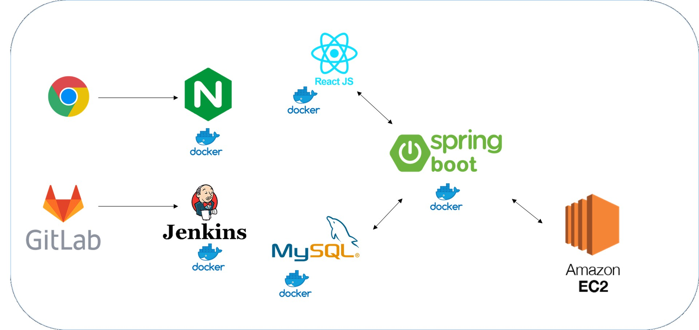
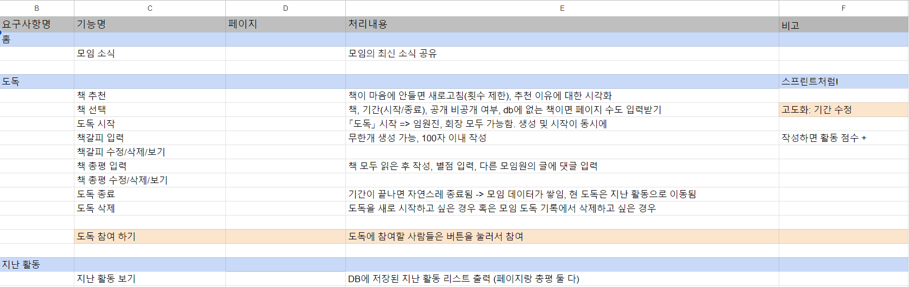
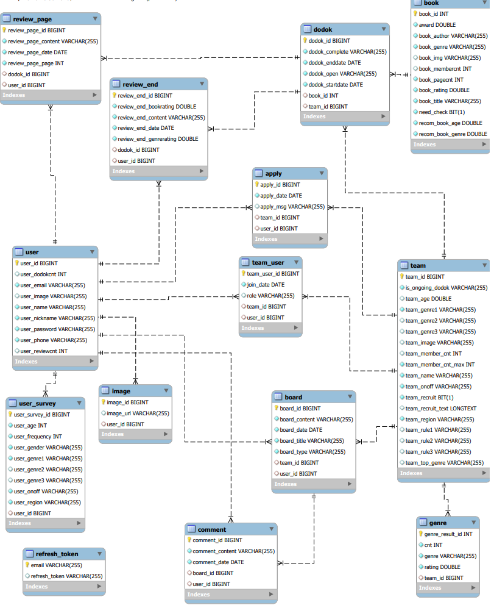
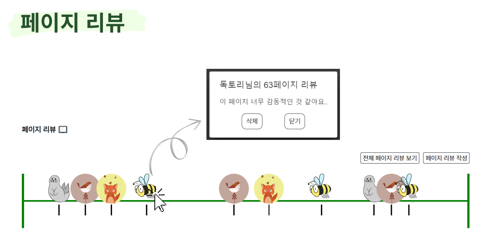
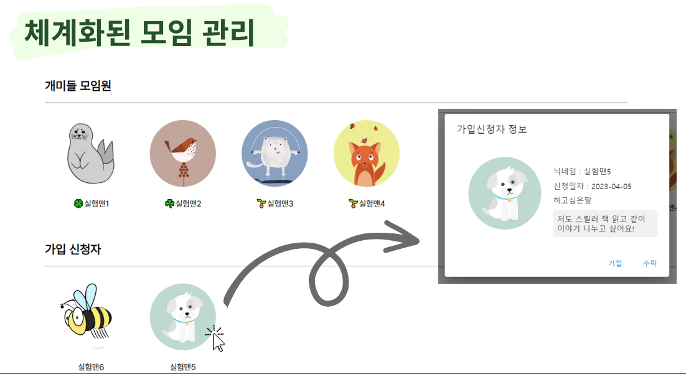

<br />

# 📚 오도독 (오늘도 독서모임)


<br />


## 📖 프로젝트 소개
 

[개요] 독서 기록 및 독서 모임 플랫폼  

[기간] 2023.02.20~2023.04.07 (7주)  

[소속] SSAFY 8기 2학기 특화 프로젝트 (빅데이터 추천) 

<br />


## 🏷 기획의도
독서모임에는 여러 장점들이 있습니다. 새로운 지식 습득, 다른 사람과 소통 가능, 좋은 자극, 생각 발전 등등..    
하지만, 사람들은 왜 독서모임을 시작할 때 주저할까요? 그 이유에는 책을 기한 내에 읽기 힘들다거나, 오프라인 모임 참여에 부담감을 느낀다는 등 여러가지 이유가 있습니다. 저희는 기존의 독서모임의 불편함 점을 해결하여 사람들의 독서모임을 장려하기 위해 본 서비스를 기획하였습니다.
<br />


## 🛠️ 기술 스택 및 환경

BackEnd
- IntelliJ
- Spring Boot 2.7.9
- Java 11
- Spring Data JPA
- Mysql

FrontEnd
- React.js(18.2.0)
- Router
- Material UI
- Redux
- React-redux
- Redux toolkit

CI/CD
- AWS EC2 (Ubuntu 20.04 LTS)
- Docker 23.0.1
- Jenkins 2.387.1
- nginx/1.18.0 

Big Data
- KNN


<br />


## 💻 아키텍처



<br />


## 📋 요구사항 명세서



<br />


## ✔️ ERD



<br />


## 📁 프로젝트 파일 구조

#### BackEnd
```
├─gradle
│  └─wrapper
└─src
    ├─main
    │  ├─java
    │  │  └─com
    │  │      └─ssafy
    │  │          └─ododok
    │  │              ├─api
    │  │              │  ├─controller
    │  │              │  ├─dto
    │  │              │  ├─request
    │  │              │  ├─response
    │  │              │  └─service
    │  │              ├─common
    │  │              │  ├─auth
    │  │              │  ├─response
    │  │              │  └─util
    │  │              ├─config
    │  │              └─db
    │  │                  ├─model
    │  │                  └─repository
    │  └─resources
    └─test
        └─java
            └─com
                └─ssafy
                    └─ododok
```

#### FrontEnd
```
├─deploy_conf
├─public
└─src
    ├─assets
    │  └─img
    ├─components
    │  ├─Main
    │  ├─MyTeam
    │  │  └─Modal
    │  └─Teams
    │      └─Modal
    ├─pages
    │  ├─MyTeam
    │  ├─Teams
    │  └─User
    ├─redux
    │  ├─slice
    │  └─store
    └─styles
```


<br />


## ⭐ 주요 기능 소개

#### 1️⃣ 모임별 맞춤 도서 추천   
- 모임의 성향 및 이전 활동을 이용하여 도서 추천을 받을 수 있습니다.


#### 2️⃣ 페이지별 리뷰 작성    
- 책의 원하는 페이지에 리뷰를 남길 수 있습니다.   


#### 3️⃣ 모임 관리   
- 체계적인 모임 관리가 가능합니다.   


#### 4️⃣ 오도독 책장   
- 공개된 활동에 한하여 다른 모임이 활동한 내역들을 볼 수 있습니다.   


<br />


## 🤜 팀원

👩‍💻 정채은 - 팀장, FE   

👨‍💻 김선규 - BE, 배포   

👨‍💻 송하엽 - 빅데이터 추천   

👩‍💻 윤명지 - BE   

👨‍💻 정무남 - FE   
 


## 📌 Git 사용 규칙
<br/>

### 브랜치 생성, 병합
---
💡 사용 브랜치

- feature - develop에서 feature 분기, 기능 추가 후 develop에 병합
- develop - feature, release를 병합하기 위해 사용
- master - release 브랜치만 병합
</br></br>


💡 feature 브랜치 생성 및 종료 과정

```bash
// feature 브랜치(feature/login)를 'develop' 브랜치에서 분기
git checkout -b feature/login develop

/* ~ feature 브랜치에서 새로운 기능에 대한 코드 작성 ~ */
git add [작성 파일]
git commit -m "type: Subject"
git push origin feature/login

// 'develop' 브랜치로 이동한다.
git checkout develop

// 'develop' 브랜치에 feature/login 브랜치 내용을 병합(merge)한다.
git merge --no-ff feature/login

// Merging 메시지 입력
i 누르기 (INSERT 모드)
# 무시하고 아래로 이동해서 type: Subject 커밋 메시지 입력
입력 후 esc
:wq + enter

// (삭제 안해도됌) -d 옵션: feature/login에 해당하는 브랜치를 삭제한다.
git branch -d feature/login

// 'develop' 브랜치를 원격 중앙 저장소에 올린다.
git push origin develop
```

</br></br>

###  Commit Convention
---
```
커밋 메시지 양식

type: Subject 설명

ex) 
feat: Add 로그인 유효성 검사 기능
```
</br>

💡 type 규칙
- feat: 새로운 기능 추가
- fix: 버그 수정
- docs: 문서 수정
- style: 코드 포맷 변경, 세미콜론 누락, 코드 변경 없음
- refactor: 프로덕션 코드 리팩터링
- test: 테스트 추가, 테스트 코드 리팩터링, 프로덕션 코드 변경 없음
- chore: 빌드 테스크 업데이트, 패키지 매니저 환경설정, 프로덕션 코드 변경 없음
</br> </br>

💡 Subject 규칙
- 동사(ex. Add, Update, Modify)로 시작
- 첫 글자 대문자
- 끝에 마침표 x

</br></br>
